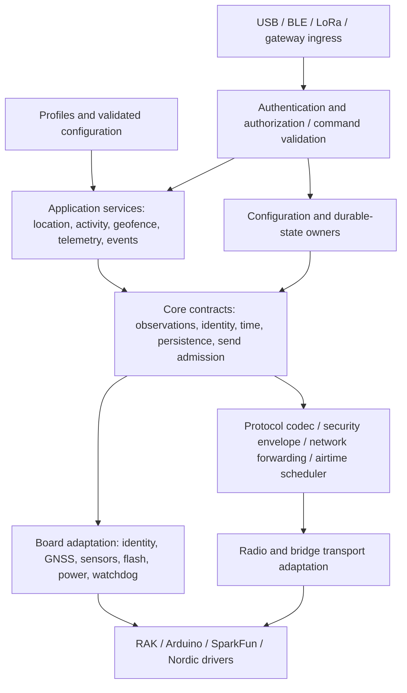

# ORUN System Architecture V1

Status: proposed architecture, ready for owner review; **not an implementation specification frozen at byte level**.
Audit date: 2026-09-14. Authoritative source: `aa3bbf810a37034d9a3d9066ede4bf579646adfe`.
Branch: `architecture/system-v1`. Scope: documentation only, private LoRa P2P.

Companion documents: [gap register](ORUN_ARCHITECTURE_GAP_ANALYSIS.md),
[protocol evolution](ORUN_PROTOCOL_EVOLUTION_PLAN.md), and
[milestone handoff](../milestones/SYSTEM_ARCHITECTURE_V1.md).
“Current” means inspected code at the above commit. “Target”, “must”, and
“future” below specify intended behavior, not functionality already available.

## 1. Mission and product boundary

ORUN is a low-power field network for tracking, sensing, events, and eventually
control and short human messaging. Livestock is the first serious application.
Reliability in hilly rural terrain, tracker battery life, recoverability, compact
radio traffic, and configuration without reflashing remain the priorities.

RAK4630/4631, nRF52840, SX1262, RAK12500 and RAK1904 remain the first-class
reference platform we own. One firmware codebase serves all node functions.
Future Heltec, ESP32, STM32, other nRF52, GNSS/radio modules and custom ORUN boards
are portability constraints, not work authorized by this architecture.

Person/child and vehicle tracking introduce sensitive location data. Fixed
sensors may measure tank level, environment, soil, power or digital inputs.
Actuators and short text/status/emergency messaging require stronger delivery
and security semantics. None of these future families is implemented here.
No LoRaWAN migration, RTOS migration, MCU plugin framework, media transfer,
Android, backend, BLE, or speculative board driver is included.

## 2. Evidence and current architecture

Evidence paths below are repository-relative and refer to the audited commit.
Historical milestone reports describe their own snapshots; R1–R4 and the two
integration fixes supersede earlier limitations where their code changed.

| Boundary | Current implementation and evidence |
| --- | --- |
| Composition | `firmware/src/main.cpp`: statically constructs radio, GNSS, nRF flash, HistoryStore, PositionFlow and RoleController; cooperative loop |
| Roles | `include/node_role.h`, `src/node_role.cpp`: TRACKER/RELAY/BASE; AUTO resolves GNSS present to TRACKER, absent to BASE; USB override is volatile |
| GNSS | `src/gnss_manager.cpp`, `gnss_utc.cpp`: detection, schedule, matching PVT/DOP, session/drain boundaries, capture age, UTC snapshot, bounded recovery |
| Position | `src/position_flow.cpp`: GnssFix → RadioManager encoder/sequence allocation → durable append/readback → one live send attempt |
| Network | `src/network_service.cpp`: POSITION-only one-hop relay; fixed four-entry queue, 16-entry relay and 32-entry BASE dedupe caches |
| Radio | `src/radio_manager.cpp`, `radio_driver_gate.cpp`: single application owner; callback event handoff; generation/role boundaries; driver gate and pinned dependency patch |
| Persistence | `history_store.cpp`, `journal_format.cpp`, `nrf_history_flash.cpp`: seven-page journal v3, persistent ticket reservations; no general config store |
| Power/recovery | `sensor_power_manager.cpp`, `i2c_recovery.cpp`, `watchdog_manager.cpp`, `monotonic_time.cpp`: rail owner mask, bounded bus recovery, loop-fed watchdog, rollover-aware time |

Paths without a `firmware/` prefix in the table are under `firmware/`.
Protocol sources and all three existing protocol documents were inspected,
along with `docs/storage`, `docs/audits`, M0–M5 reports, the host runner and
relevant M3/M4/M5/R2/R3/R4/startup tests.

Important corrections to prototype shorthand:

- GNSS polling/detection is independent of role. Only TRACKER consumes fixes
  into PositionFlow. Selecting BASE/RELAY does **not** currently switch GNSS off.
- All current roles restore continuous RX between transmissions; tracker RX
  windows and measured low-power radio scheduling are not implemented.
- RF and GNSS settings are compile-time constants, not persistent runtime config.
- TEST decoding remains; production periodic TEST beacons are disabled.
- M4 is store-first history infrastructure. It does not automatically replay
  backlog or receive delivery receipts. M5 adds no ACK or delivery confirmation.
- `TX_DONE` is local completion only. Dedupe is bounded RAM, not authentication
  or a durable replay-defense mechanism.

### Physical evidence boundary

The owner reports two USB-visible RAK4631 devices, production uploads to both,
USB role commands, real SX1262 A→B transfer with matching source ID/sequence and
RSSI/SNR, and no reset loop during that RF test. RAK12500 detection, acquisition
start, and timeout/low-power release behavior have been demonstrated; production
was restored after temporary GNSS testing. These are owner-provided observations,
not new hardware measurements performed by this audit.

Still unproven: open-sky ORUN GNSS FIX; GNSS→storage→POSITION TX→BASE RX;
physical relay of real POSITION; injected stuck SDA/SCL recovery; intentional
watchdog stall/reset; flash power-cut recovery; electrical WB_IO2/3V3_S behavior;
current/power measurements; long-range field RF; enclosure/mechanics. Software
builds and host models do not close any of these gates.

## 3. Target layers and dependency direction

Arrows show use/flow; compile dependencies use inversion at contracts: services
include small core declarations; adapters implement those declarations and may
include them. Core declarations never include adapter headers. `main.cpp` is the
composition root and may know both concrete adapters and services. Network
framing and transport are siblings of sensor adaptation, not sensor business
logic. Application payloads become bounded bytes before radio admission.

Core owns portable values, validation and state transitions. Board adaptation
owns registers, pins, device-driver calls, physical resource mappings, interrupt
handoff and platform timing. Profiles supply defaults only. Protocol codecs own
bytes, transport owns I/O, network owns forwarding/dedupe, and the scheduler owns
admission. Services must not call Arduino Serial or physical radio APIs.

Use statically allocated objects, explicit completion results and fixed buffers.
Introduce a small seam when a real dependency needs isolation or multiple
services need it. No global event bus, general dependency injection, deep virtual
hierarchies or extensive templates are required. Existing pure codecs,
NetworkService, FlashBackend and owner-loop design are assets to preserve.

## 4. Independent concepts: identity, role, profile and capabilities

| Concept | Owner/meaning | Must not imply |
| --- | --- | --- |
| DeviceIdentity | Stable logical ORUN node key | User, name, phone, radio readiness |
| Hardware model/revision | Board descriptor and actual population | Application or topology |
| NetworkRole | END_NODE or RELAY forwarding responsibility | GNSS, power source, human identity |
| Gateway service | Bridges LoRa with USB/BLE/IP as configured | Relay enabled or internet available |
| Profile | Versioned preset/default bundle | Immutable capability restrictions |
| Capability | Physical support and observed availability | Service enabled or permission granted |
| Enabled service | Requested and effective function | Hardware exists just because requested |
| Location source/owner | Explicit source allowed to update active point | Network role |
| Power policy | Availability/energy contract | Fixed mapping from role enum |
| Transport | Byte ingress/egress mechanism | Business validation rules |
| User identity/assignment | Account and ownership relationships | Device's immutable identity |

Prefer **END_NODE / RELAY** as the small forwarding enum, plus independently
enabled gateway bridges. GATEWAY is useful UI/profile terminology, but a third
mutually exclusive enum value cannot describe a gateway that also relays without
another flag. BASE remains a legacy alias and current receiver behavior; do not
rename it on the wire or change its runtime behavior here. A gateway can receive
and bridge without repeating RF packets, or enable the relay responsibility.
Animal tracker presets must never forward other trackers' packets.

Legacy compatibility mapping in a later change: TRACKER → END_NODE + livestock
tracking preset; RELAY → RELAY + availability preset; BASE → END_NODE + local
receiver/base preset, with bridge services only when actually implemented.
Preserve current continuous RX and GNSS behavior during that mapping. New explicit
power/source choices are separate, reviewable behavior changes.

AUTO GNSS→TRACKER is a legacy bootstrap heuristic only. Future unprovisioned
bootstrap may offer a suggested preset after detection, but must not overwrite
saved configuration or change network responsibility after a sensor failure.
A configured tracking service without GNSS reports unavailable until an explicitly
selected alternative supplies location. It does not turn itself into a gateway.

### Profiles and capability discovery

ANIMAL_TRACKER defaults eventually select GNSS, local geofence/activity and
battery optimization; VEHICLE_TRACKER selects motion-aware reporting and external
power preference; PERSON_TRACKER has explicit privacy/access policy; FIELD_SENSOR
selects telemetry, optional/off GNSS and manual/phone location; FIELD_ACTUATOR
adds local output safeguards; MOBILE_SEARCH favors continuous RX and phone/BLE
availability; GATEWAY favors bridging and RX. Preset application is an explicit
config transaction showing changed fields, preserving documented user overrides.
Profile revision changes must not silently reapply new defaults to existing nodes.

Distinguish declared support, detected presence (including UNKNOWN/UNPROBED),
current health, requested enablement, and effective enablement. Declaration is
appropriate for soldered radio/USB/BLE hardware; bounded probe is appropriate for
optional GNSS/sensors. Rail-off or transient bus failure is not proof of absence.
No claim of solar charging, battery measurement or valve feedback follows solely
from a connector or generic board model.

Capability registry may cover LORA, GNSS, BLE, USB, ACCELEROMETER, BATTERY,
EXTERNAL_POWER, SOLAR, TANK_LEVEL, TEMPERATURE, HUMIDITY, SOIL_SENSOR,
DIGITAL_INPUT, ANALOG_INPUT, RELAY_OUTPUT, VALVE_CONTROL, PUMP_CONTROL,
GATEWAY_UPLINK, STORAGE and SECURE_ELEMENT. IDs/encoding remain unallocated.
Actuator capability also needs channel, limits and feedback metadata. Unknown
capabilities may be displayed as unsupported, never enabled speculatively.

Valid combinations include RELAY + GNSS present + PHONE owner + GNSS OFF;
GATEWAY + GNSS; BASE/RELAY/TRACKER + PHONE; fixed sensor + MANUAL. Missing
hardware produces a reasoned service status, not a rewritten role.

## 5. Service ownership

Names below describe bounded responsibilities, not a requirement to create one
C++ class for each row now.

| Service/boundary | Owns | Depends on / excludes |
| --- | --- | --- |
| Location | Source arbitration, acceptance, last-known point and revision | Neutral observations, clock and durable state; no u-blox parser |
| Tracking flow | Fresh moving reports and store-before-send | Location observation, existing history/codec/send seam; no role inference |
| Telemetry | Metric sampling schedule, scaling, quality and batches | Sensor observations; no per-sensor network stack |
| Activity | Lightweight window features/classification | Accelerometer; mounting-specific validation, no raw XYZ stream |
| Geofence/LOST | Local polygons, hysteresis, timers, free-graze and events | Accepted fresh location, quality and authenticated contact evidence |
| Events | Stable occurrence IDs, severity, persistence/receipt policy | Scheduler and typed durable records |
| Commands | Authorization context, validation, idempotent execution/results | Config/application handlers; no transport-specific rules |
| Configuration | Schema, defaults, revisions, atomic validation/commit | Partition-backed persistence; no secrets in ordinary config dump |
| Health | Aggregated diagnostics and degraded-service status | Bounded counters/snapshots, rate-limited reporting |
| Messaging | Endpoint message identity, TTL and delivery tracking | Opaque network payloads, bounded mailbox; user identity separate |
| Store-forward | Per-class retention and retry eligibility | Durable records and receipts; no unlimited common FIFO |
| Network | Addressing, route policy, forwarding, duplicate observations | Validated envelope and scheduler; not sensor payload interpretation |
| Airtime scheduler | Bounded queues, deadlines, fairness and radio admission | PHY airtime estimate, regional policy, radio availability |
| Power coordinator | Resource requests, next deadline and wake constraints | Board energy mechanisms; not role-specific pin writes |

Geofence stays local: multiple permitted polygons, INSIDE/NEAR_FENCE/OUTSIDE,
quality/hysteresis/repeated-fix filtering; timed/manual FREE_GRAZE suppresses
normal violations while optional critical distance remains. LOST is locally
OUTSIDE plus configurable absence of successful network contact (conceptually
three hours). Current TX_DONE cannot provide that contact evidence. Until an
appropriate authenticated receipt/contact mechanism exists, do not claim a
working network-contact-based LOST transition. Activity accuracy remains
unvalidated until collar mounting and animal trials establish it.

## 6. Hardware contracts and portability

Known leaks: SparkFun header and UBX callback declarations in the public
`gnss_manager.h`; PositionFlow includes RadioManager and consumes GnssFix;
RadioManager knows GNSS fields, encoding, identity and Serial diagnostics;
`flash_backend.h` declares NrfHistoryFlash alongside the portable contract;
`storage_config.h` mixes geometry and nRF absolute addresses. These are bounded
migration opportunities, not reasons to replace R1–R4.

Appropriate adapter details include WB_IO2 in SensorPowerManager, GPIO/Wire bus
recovery, nRF watchdog/reset registers, FreeRTOS tick adaptation and SX1262
initialization. Move their declarations/implementation boundary only as needed;
register details existing inside adapters are not inherently architectural bugs.

| Minimal contract | Semantics required before another board uses it |
| --- | --- |
| Identity provider | Stable identity available before radio/storage failure; exact legacy bytes |
| GNSS observation | Integer neutral observation, measurement/capture time, quality, explicit validity, bounded completion/failure |
| Radio transport | Maximum frame, copied RX lifetime, one TX owner, completion vs receipt, bounded cancellation/quiescence |
| Flash backend | Geometry, alignment, erase/program contract, durable completion, exclusive region and fault results |
| Clock | Monotonic deadlines vs optional UTC, wrap limits, reboot/time-quality semantics |
| Power/rail | Board-mapped resource ownership, settling, unsupported-mode result; shared dependencies |
| Sensors | Bounded sample/result with unit, quality and failure, separate interrupt/rail mapping |
| Reset/watchdog | Reset reason, timeout/feed behavior, retained state assumptions |
| Diagnostics sink | Structured bounded events adaptable to Serial/USB; no compulsory LoRa chatter |

First isolate neutral GNSS data and identity; retain implementation structure and
host regression seams. Split concrete flash declaration when needed, without
changing geometry. Broader radio/clock/board interfaces are due before a real
second board, using that board to validate minimality. A new platform contributes
board support, driver integration, capability declaration and contract tests;
it must not redefine core location, event, command or backend semantics.

The present Arduino/PlatformIO pins and dependency patches remain pinned.
Upgrade reviews must rerun source guards, host regressions and board tests,
including interrupt ordering and bounded I2C. No new HAL framework is selected.

## 7. Device identity lifecycle

Current `RadioManager::begin()` calls `BoardGetUniqueId()` before any failure
return and binds the sequence source early. The pinned nRF52 implementation in
`.pio/libdeps/rak4630/SX126x-Arduino/src/boards/mcu/nrf52832/board.cpp` reads
factory register words at `0x10000060` and `0x10000064`. Byte index order is
assembled most significant first into uint64. Verify that dependency path when
upgrading; preserve existing values exactly, including serial formatting.

Target DeviceIdentity is an opaque stable logical identifier, initially capable
of representing all legacy uint64 IDs losslessly. Its API does not expose the
MCU register recipe. Existing RAK IDs are grandfathered; there is no remapping
or history-key migration here. Server IDs must use lossless binary/hex/string
representation, never a floating-point JavaScript number for uint64.

Future boards use provisioned identity, or a documented namespaced hardware
identity scheme assessed for collisions before release. Blindly truncating an
ESP32 MAC or STM32 UID is insufficient. Logical-ID width/namespace for new
boards remains an owner/security decision; backend may have an internal primary
key with a unique, immutable external identity mapping.

Ordinary firmware update and config reset preserve identity, history identity
binding, keys and anti-replay state. Ownership transfer preserves device ID but
revokes prior user access and rotates affected credentials; shared historical
access is explicitly decided. Secure decommission clears secrets and user data
with documented limits of flash deletion. Authorized factory reprovisioning is
a separate operation from reset-to-default; it must prevent key/nonce reuse.

Duplicate identities cannot be reliably detected by current unauthenticated v1.
Future enrollment binds identity to credentials; conflicting authenticated
credentials or incompatible concurrent state cause quarantine and an owner
alert, never silent database overwrite. A byte-for-byte stolen key clone may
remain indistinguishable; revocation/reprovisioning is required. Identity is not
proof of possession, human name, user ID or server account.

## 8. Configuration and command ingress

Target flow: transport framing → authenticated issuer/session where required →
Command handler → validation → Config/application change → durable commit →
applied-result/event. USB, BLE, radio and gateway adapters call the same rules.
Physical USB access is an explicit trust policy, not automatically unlimited
administration. Current bounded USB ROLE parser remains a development mechanism.

Config schema categories: network forwarding, profile/revision, enabled services,
location source/AUTO policy, node advertisement cadence, tracking cadence, GNSS
and system power policy, sensor/activity settings, geofence/free-graze/LOST,
relay limits, gateway bridges, telemetry intervals and security references.
Secrets themselves are separately owned.

Validate whole candidate state after merging a partial update: ranges, timer
half-range/overflow, capabilities, interlocks, storage and airtime budgets.
Reject the transaction atomically with per-field reasons if inconsistent.
Use expected config revision to reject concurrent edits; separate desired,
persisted and effectively applied revisions (e.g. radio transition at quiescence).
Report persistence failure; do not report durable success for a RAM-only edit.

Defaults have explicit versions; migrate known schemas transactionally without
erasing the only good copy. Unknown required fields/schema fail closed;
unsupported optional fields may be preserved only with bounded explicit length
and a specified policy. Read-modify-write clients must not delete fields they
do not understand. Downgrade to unsupported configuration enters maintenance or
safe disabled-service mode and preserves bytes, not automatic factory reset.
Reset settings separately from CLEAR location, erase history, transfer ownership
and erase security material. No config partition or format is allocated here.

## 9. Flash and persistence architecture

All addresses below are end-exclusive. Installed evidence is the Adafruit core
`cores/nRF5/linker/nrf52840_s140_v6.ld`, `libraries/InternalFileSytem/src/`
`InternalFileSystem.cpp`, `flash/flash_nrf5x.c`, Bluefruit `bluefruit.cpp` and
`utility/bonding.cpp`, plus repository board JSON, storage config and
`scripts/check_storage_layout.py`.

| Range/quantity | Proven ownership or explicit uncertainty |
| --- | --- |
| `0x00000..0x26000` | Reserved below linked application for MBR/SoftDevice by linker; exact installed contents/subdivision not measured |
| `0x26000..0xED000` | Application linker region, 815,104 bytes; unused linked capacity is firmware growth space, not an allocated data partition |
| `0xED000..0xF4000` | Seven 4 KiB pages; ORUN exclusively owns core InternalFS reservation as history v3 |
| `0xF4000..0x100000` | Bootloader/reserved high-flash area; do not treat any part as free |
| `0xFF000` | Bootloader settings address declared by `rak4630.json`; exact installed bootloader/other metadata extents need board readout |
| UICR/FICR | Separate SoC configuration/factory regions, not general application storage |

The last serial-fix report records 139,544 bytes linked flash against 815,104
capacity. This is historical build evidence, not a fresh measurement or a DFU
bank allocation. No maximum update image, dual-bank arrangement or rollback
space is proven. Installed ELF alone is not proof of the flashed bootloader.
Before repartitioning, inspect ELF load extents, exact bootloader and SoftDevice
images, settings/MBR parameters, UICR boot address and upload/DFU erase policy on
both physical devices. Record hashes, addresses, maximum image and migration
power-cut tests. No adjacent page is authorized for writing by this document.

Current history: 352-byte page header, 104 × 36-byte records/page, maximum 728
records; about 7.58 days at 15 minutes, temporarily fewer during page rotation.
Fourteen days requires 1,344 records and is not met. R1 uses aligned synchronous
Nordic program/erase with readback, CRC and final commit; only the reclaimed
page is erased. TEST/POSITION share 256-ticket persistent reservations. v2-only
legacy development journals are refused; total unrelated header destruction is
outside guaranteed recovery and can reset sequence identity. Preserve these
limits honestly; current ticket persistence is not yet a security nonce store.

| Category | Target ownership and recovery |
| --- | --- |
| CONFIG | Versioned settings snapshots; atomic old/new selection; coalescing and equal-write suppression |
| DURABLE STATE | Last valid phone/manual point, revisions, relevant reported state; independently versioned and committed |
| HISTORY | Circular observations/events with class-specific retention; original measurement identity/time preserved |
| SECURITY MATERIAL | Provisioned keys, key generations, replay/nonce metadata; restricted reads and anti-rollback lifecycle |
| TRANSIENT QUEUES | Fixed RAM scheduling entries, discard/reconstruct on reset |
| DURABLE WORK | Explicit opted-in command/result or message mailbox records with expiry, quota and recovery rules |

Logical categories can share a verified allocator later, but cannot become one
untyped journal with identical erase/reset/retention policy. Security integrity
needs more than CRC. EEPROM-like per-update whole-page erase is unsuitable.

Prefer evaluating an explicit reduction of the application linker ceiling to
reserve new pages below history, versus external storage, rather than taking a
history page. This is an **option for a separate layout milestone**, not an
address allocation. It requires bootloader/DFU agreement, growth reserve, tested
migration and updated build/runtime ownership checks. Two-copy config atomicity,
phone update endurance, security counter reservations and BLE bond storage must
be budgeted together. If safe capacity cannot be proven, block new persistent
features rather than borrowing pages.

Every accepted PHONE point should be durably committed before durable acceptance
is returned when persistence is enabled. Apply bounded input rate/admission and
no-op suppression to control wear; a volatile preview must be labeled volatile,
not acknowledged as reboot-safe. If persistence fails, preserve the previous
committed point and report the rejection. Explicit CLEAR requires a durable
revision/tombstone so old copies cannot resurrect after reboot or server sync.

M7 blocker: normal `Bluefruit.begin()` calls `bond_init()` which mounts InternalFS
in the journal region; the current flash backend also refuses SoftDevice-enabled
writes. Keep those guards. Before BLE, design asynchronous Nordic flash event
routing, owned buffers, completion/failure/lifetime semantics and exclusive
bond/config/history partitions together. Never solve this by removing guards.

## 10. Location architecture and ownership

Location is a source-neutral observation plus state, not a GNSS driver. Suggested
integer values: latitude/longitude E7; optional altitude mm with datum; horizontal
accuracy mm with explicit known flag; measurement UTC if trustworthy, capture
monotonic time/session, time quality and revision. HDOP is dimensionless quality,
not accuracy in metres. Keep GNSS satellites/HDOP as source-specific metadata.
Do not invent them for PHONE/MANUAL or encode those sources into legacy POSITION.

`LocationMode = GNSS | PHONE | MANUAL | NONE | AUTO` selects ownership policy.
Active owner is singular; NONE stops active updates/publication but preserves
last-known data. AUTO requires explicit ordered sources, validity/age thresholds,
switch hysteresis and ownership-change events; no implicit fallback is allowed.
Future external sources require their own trust and measurement semantics.

Retain source-specific last valid values and an active-owner revision. On source
switch, preserve the old point as last-known with its original source; do not
relabel it as the new source. Until that source supplies valid data, report
awaiting-source plus last-known metadata. A queued update includes source/session
and expected ownership generation so an old phone session cannot win after a
mode change.

| Input while PHONE owns location | Required transition |
| --- | --- |
| Authorized connected phone, valid newer position | Accept after range, optional-field, quality/time and revision checks; update last valid PHONE point |
| Disconnect, silence, OS location off, permission lost | Preserve point/revision; availability changes and age grows |
| Empty parse, invalid coordinates, non-finite conversion, malformed update | Reject update; preserve last valid point; report reason |
| GNSS fix | May retain separate GNSS diagnostics/observation; never overwrite active PHONE location |
| Reconnect while still PHONE | Resume valid updates after session/authorization validation |
| Reboot with persistence enabled | Recover committed last-known PHONE point; never mark it live solely because boot occurred |
| PHONE OFF / mode NONE / periodic OFF | Stop respective activity; keep stored point |
| Explicit authorized CLEAR | Commit deletion/tombstone and new revision; report UNKNOWN after success |

Both latitude and longitude zero are valid coordinates, never a missing-value
sentinel. Unknown UTC is an explicit state, not proof of a new measurement.
Out-of-order phone data is rejected using session/revision and timestamp quality;
a backward wall clock does not invalidate monotonic local deadlines.

### Freshness and UI state

Separate validity, source availability, freshness, movement suspicion and device
connectivity internally. Derive UI labels: UNKNOWN when no valid point; STALE
when freshness/age rules or DEVICE_MOVED invalidate currency; LIVE/CURRENT only
when an active valid source and policy support it; otherwise LAST_KNOWN. A
connected phone without valid updates is not live. An offline node may still
have a useful last-known point. Fixed manual positions may remain valid by policy,
but “configured location” must not imply a recent sensor fix or current contact.

Show source, last measurement/update, age or “age unknown”, state and last_seen
separately. Across reboot without trusted UTC/retained elapsed time, do not invent
age; mark unknown-age/last-known conservatively. Gateway reception timestamp is
not measurement time. This model also applies to tank level, battery, health
and actuator feedback. Example: 72%, measured 13 hours ago, device offline.

### POSITION versus NODE_LOCATION and advertisements

Keep the 34-byte v1 GNSS POSITION unchanged for time-sensitive tracking. Future
NODE_LOCATION is a separate semantic family for configured/known physical node
position with source, validity, observation time/time quality, revision, optional
accuracy/altitude and movement suspicion. It is not restricted by network role.
Mobile search may consume live location while infrastructure advertises known
location; these are distinct publication policies.

Target node advertisement: on valid change, enqueue promptly under rate/airtime
limits; optional boot publication with jitter; publish-now command; configurable
periodic OFF/15m/30m/1h/3h/6h/12h/24h/CUSTOM. Candidate infrastructure default is
on-change plus six-hour repeats, subject to measured fleet airtime and policy.
Coalesce superseded changes; a phone's frequent fixes must not trigger a radio
packet per fix. Periodic OFF deletes nothing. Repeats preserve measurement time
and revision; they must not refresh a stale point. Boot publication never makes
recovered data live. Tracker POSITION cadence is a different setting.

For future fixed-node movement detection, retain coordinates but latch
DEVICE_MOVED/STALE suspicion and ask the user to update/confirm location.
Do not clear, infer coordinates from acceleration or let an old repeated phone
sample automatically clear the movement warning.

## 11. GNSS and system power policy

Current M3 defaults are 15-minute tracking, 120-second acquisition timeout,
60-second short-interval threshold and two-second minimum useful off period.
Long-interval low-power behavior releases the switched rail; backup/RTC retention
and current savings are not electrically proven. Preserve R3 PVT/DOP pairing,
transport drain, acquisition boundaries, UTC conversion and five-second live
admission age through any adapter extraction.

Future GNSS policy offers OFF, BACKUP, POWER_SAVE, CONTINUOUS, AUTO only when the
module/board supports the requested state. OFF means no requested GNSS operation;
a shared powered rail can prevent physical removal of power. BACKUP requires
verified backup supply/RTC retention. POWER_SAVE needs driver-specific support.
CONTINUOUS is useful at short intervals or abundant power. AUTO chooses from
supported modes based on interval, recent TTFF, next deadline and energy budget;
thresholds require real current/TTFF trials. Missing GNSS is a capability status,
not a role error. GNSS present on BASE/RELAY/GATEWAY may explicitly be OFF.

PowerCoordinator eventually combines MCU idle/sleep, radio receive commitments,
GNSS/sensor settling, BLE sessions, flash completion, actuators, deadlines and
wake sources. Availability constraints may reject a sleep request. A battery
relay needs an explicit availability tradeoff, not hidden tracker sleep behavior.
Solar budget and low/critical battery stages are measured policy inputs. Local
safety limits override energy optimization for outputs; animal trackers still
protect their battery. Do not claim low-power current from cooperative idle.

SensorPowerManager already uses idempotent owner bits, not reference counts.
GNSS release cannot clear another owner's bit. Keep one bit per independent
consumer; repeated acquire by one consumer does not require repeated release.
Use reference counting only if a real nested ownership requirement appears.
Shared I2C reset/reconfiguration likewise needs coordination before a second
sensor is active. RAK1904 must not be assumed to use 3V3_S: verify slot wiring
and potential WB_IO2 interrupt conflict before M6 assembly.

## 12. Telemetry and events

Telemetry is a measurement, not an occurrence or command result. Use metric IDs
with documented units, integer scaling, sensor/channel instance, observation time
or batch-relative age, validity/quality and status. Absent/invalid is not zero.
Overflow and unknown scale must reject or mark unsupported, never silently wrap.

| Encoding option | Benefit | Cost/risk | Recommendation |
| --- | --- | --- | --- |
| Fixed packet per sensor | Minimal bytes, simple strict parser | Packet explosion, poor optional evolution | Retain legacy POSITION; use only justified high-volume fixed families |
| TLV per reading | Unknown values can be skipped by validated length | Repeated headers increase airtime | Candidate for heterogeneous/optional metrics |
| Metric ID + schema-implied integer | Compact repeated data, clear units | Registry/version mismatch; unknown ID has no implicit length | Pair with explicit length/type or versioned batch schema |
| Schema-based encoding (e.g. bounded CBOR/Protobuf) | Tooling and optional-field evolution | Library/schema footprint, worst-case size and parser complexity | Benchmark actual bounded implementations before selection |
| Mixed family header + bounded metric entries | Shared time/source overhead, extensibility | More than one encoding rule | Preferred direction for experiments, not a final wire format |

Compare representative battery-only, tank+temperature and multi-sensor batches
under actual PHY settings, parser RAM/flash, malformed inputs and old decoders.
Do not choose merely by desktop serialization convenience. Set maximum readings,
bytes and batching latency; urgent measurements must not wait for a full batch.

Events carry a stable source-scoped occurrence ID (durable epoch/counter design
pending), event type, occurrence time/time quality, severity, lifecycle and compact
context. Examples include GEOFENCE_NEAR/EXIT, LOST, LOW/CRITICAL_BATTERY,
TANK_LOW/HIGH, MOTION_DETECTED, DEVICE_MOVED, SENSOR_FAILURE, TAMPER, POWER_LOSS
and ACTUATOR_FAULT. Repeated observations of one condition are not new alarms.
Separate onset, update and clear using related IDs/revisions. Persist critical
occurrences before transmission when storage/power permits; make imminent power
loss a documented best-effort case if persistence cannot complete.

Critical events need authenticated receiver receipt and controlled retries with
backoff, expiry and bounded airtime. Transport receipt is separate from human
acknowledgment. Dedupe by event identity across reboot at the consumer; changing
radio sequence on retry must not create a new event. Event retention/quota is
separate from cyclic ordinary measurements.

## 13. Commands and actuator safety

Future command envelope includes destination, issuer/device context, command ID,
typed arguments, issue time/time quality, expiry/deadline, security generation,
authentication and authorization scope. Network receipt precedes validation;
validation precedes any effect. Keep a bounded durable idempotency ledger for
non-repeatable effects. Duplicates with the same ID and different arguments are
conflicts; same ID/arguments returns the stored result without re-execution.
Expiry is checked at acceptance **and execution**, including after reboot.

| State | Evidence required |
| --- | --- |
| REQUESTED | Local intent recorded |
| SENT | Transport dispatched; delivery unknown |
| RECEIVED | Destination confirms receipt, before business acceptance |
| ACCEPTED | Destination authenticates, authorizes, validates and durably admits when required |
| EXECUTED | Handler reports attempted/completed effect with result |
| CONFIRMED | Fresh trustworthy reported state/feedback verifies the specified outcome |
| FAILED | Explicit terminal rejection/execution failure with reason |
| UNKNOWN | Outcome ambiguous, e.g. result lost or reboot during physical effect |

These are observed milestones, not a promise every intermediary sees every step.
ACK is not RESULT and software drive completion is not physical valve feedback.
UI displays desired OPEN separately from reported OPEN with feedback time/quality.
Timeout after a possible effect is UNKNOWN, not “closed” or safe to repeat.
Set-state operations are preferable to toggles; even repeating OPEN must not
restart a maximum-open safety timer. Exactly-once physical actuation is not
promised across power failure without reconciliation/feedback.

Before any actuator implementation, specify per-device safe output behavior on
boot, watchdog reset and power interruption; local max-ON/open duration, sensor
interlocks, local manual override and electrical defaults. Safe state may depend
on the process; no universal “close everything” policy is assumed. Local limits
cannot be relaxed by an expired, duplicated, unauthorized or remote command.
Network loss must not extend a lease or disable an interlock. Unknown feedback,
stale server state and compromised gateways cannot imply confirmed output state.
Without trustworthy time, use an authenticated bounded session/relative deadline
scheme or reject time-sensitive remote actuation. Never execute an old queued
command merely because connectivity returned.

## 14. Messaging and bounded mailboxes

Messaging is a future application over the network envelope, not a new radio
stack. Initial scope is short UTF-8 text/status/emergency, not images/audio/video.
Paths may be phone→BLE→node→one RF relay→gateway→phone, or two independently
bounded RF domains bridged through a server. Local messages must work without
internet where topology and endpoint availability permit. Downlink rendezvous
for sleepy nodes is a design dependency; continuous relay RX alone cannot wake
an unavailable destination.

Separate user/account, device, endpoint session, direct recipient, group/channel,
and ownership assignment IDs. A user can change phones or own/lend multiple
nodes; infrastructure need not belong to one human. Offline authorization and
recipient key availability require a provisioning policy; no implicit user-ID
mapping from device ID is acceptable. Groups and channels remain future scope.

Message identity remains stable across RF retries and gateway/server bridges.
Include sender context, recipient scope, creation time/time quality, TTL, content
type and delivery-request policy. Distinguish radio TX complete, network/custody
acceptance, destination node receipt, destination app receipt and human read.
UI SENDING/SENT/DELIVERED/READ/FAILED/EXPIRED must name what delivery endpoint
confirmed; recommend DELIVERED for destination application receipt, with node
receipt as intermediate diagnostics. READ is optional app-level acknowledgment,
never inferred from BLE connection. Emergency classification requires authorization
and rate limits; chat cannot self-assign unlimited critical airtime.

Mailbox limits must cover total bytes, total messages, per-user/device quotas,
maximum lifetime and bounded retry count. Reject excess with a clear reason;
expire old low-priority work before protected critical records, never silently
claiming acceptance. Persistent acceptance means the node committed custody;
volatile queueing must be labeled differently. Retain until appropriate receipt
or expiry, then mark delivered/delete logically without repeated RF sends.
Lost ACKs cause deduplicated retries, not new human messages. Reboot recovery
rechecks TTL, authorization and key generation. If elapsed time is unknown,
quarantine expired-possible work pending trusted time rather than extend TTL.

Prefer ciphertext at relay/gateway mailbox; define access, deletion and metadata
retention. Flash logical deletion does not prove physical erasure. Endpoint E2E
keys remain distinct from network forwarding credentials. Relays should route
without plaintext; visible addresses/timing still leak metadata. Fragmentation
is optional and bounded by bytes/fragments/concurrent assemblies, timeout and
per-source quota; authenticate before expensive reassembly. Prefer a short
unfragmented first release; no unbounded heap assembly or media feature creep.

## 15. Network forwarding, gateway and QoS

RELAY means LoRa→LoRa range extension. Gateway means LoRa↔USB/BLE/IP bridge.
One physical node can do both under explicit policy. No internet dependency is
needed for local reception/relay/geofence/LOST. Local gateway app crashes may
remove that bridge but must not take down MCU forwarding. Backpressure bounds
all bridge queues; recovered server connectivity drains gradually.

Current relay is exactly 49 bytes enclosing one original 34-byte POSITION,
one hop, no nested forwarding. Preserve it. Target generic forwarding validates
network structure/authentication, destination scope, stable message identity,
hop budget, expiry and queue admission without decoding private application
content. A fixed maximum envelope size and allowlisted version/service policy
are still needed; “generic” does not mean blind forwarding of arbitrary RF.

Keep one RF relay hop as the target initial constraint. No mesh routing protocol
is justified by this audit. For downlink/messages, specify bounded unicast/local
broadcast reachability and relay rules before enabling them. Gateway bridging
must retain origin identity and enforce bridge-domain loop suppression and
end-to-end expiry; crossing IP must not reset RF limits to permit bouncing.
See [protocol plan](ORUN_PROTOCOL_EVOLUTION_PLAN.md) for immutable authenticated
fields versus mutable forwarding metadata and legacy coexistence.

### Airtime admission and scheduling

Future scheduler takes a bounded descriptor: immutable bytes/reference lifetime,
class, source, deadline, retry eligibility and airtime estimate. It is the single
admission point before the existing radio owner starts TX. Do not bypass the R2
gate, preempt active radio packets or let callbacks run business handlers.

| Class | Typical work | Discipline |
| --- | --- | --- |
| Safety/critical | Authorized LOST, emergency, critical fault | Reserved queue/admission budget, bounded retries; no unlimited critical marking |
| Control response | Command ACK/RESULT, necessary contact receipts | Short expiry and reserved slots to prevent response starvation |
| Live operational | Fresh position, geofence event | Deadline-aware; newest useful state replaces superseded unsent state |
| Routine | Telemetry, node location/info/health | Coalescing, per-source fair airtime shares |
| User messages | Ordinary short chat | Bounded quota/fair share; emergency variant separately authorized |
| Background | Historical replay, bulk mailbox recovery | Opportunistic airtime, pause for live work |

Strict priority alone can starve lower classes. Use reserved budgets plus weighted
or deficit airtime fairness and aging within safe bounds. Safety can consume
reserved capacity but cannot bypass regional limits; reject admission visibly
when demand is impossible. Cap retries, use randomized backoff and avoid
synchronized boot/reconnect bursts. Per-source fairness prevents one faulty
sensor or phone monopolizing a class. Account in airtime, not just packet count.

Current same-profile estimates are POSITION 987.136 ms and RELAY_FORWARD
1232.896 ms (M5 formula, not measured). One relayed datum costs about 2.220032 s
across the two transmitters before duplicates/retries; each transmitter has its
own budget. For a hypothetical 49-byte repeat every six hours, four repeats cost
about 4.931584 s/day per transmitting node, excluding changes/boot/security.
This is only a proxy; NODE_LOCATION length is undecided. One hundred such nodes
can still collide during synchronized startup. Model fleet load and relay
amplification before selecting announcement defaults.

A regional policy boundary supplies permitted channels/power, airtime and any
applicable duty-cycle/dwell/listen-before-talk rules after jurisdiction-specific
verification. No legal percentage or exemption is asserted here. Aggregate all
traffic classes, retries and bridges; budget enforcement must handle reboot
conservatively rather than reset into an unlimited burst allowance. Frequency,
14 dBm power, SF11/BW125/CR4/5, sync word and current timing remain unchanged.

## 16. Security and privacy threat model

Current v1 has no cryptographic authentication, confidentiality or replay defense.
Private sync word and PHY CRC are not security. This is an accepted prototype
limitation, not suitable protection for private person location, messaging,
remote configuration or actuation. No active control exists to secure today;
security is a release gate before adding these operations.

| Threat | Required boundary/control | Residual risk |
| --- | --- | --- |
| Passive listener/location tracking | Encrypt sensitive payload; minimize advertisements and retention | RF timing, activity and visible routing metadata remain observable |
| Spoofed device/gateway; cloned ID | Provisioned per-device credentials, authenticated enrollment, conflict quarantine | Stolen identical key clone may be indistinguishable until revocation |
| Telemetry/message manipulation | Mature AEAD with immutable headers bound as associated data | Compromised legitimate endpoint can lie |
| Unauthorized config/valve/pump | Destination authorization, scopes, expiry and local safety limits | Authorized malicious operator still needs local limits |
| Packet/command replay | Durable nonce/counter generation, replay windows, command idempotency | Counter rollback or unsafe restore can break security |
| Malicious relay | End-to-end payload protection, bounded forwarding, authenticated hop metadata as needed | Drop/delay/jam cannot be prevented by encryption |
| Stolen device | Key storage/access policy, revocation, future secure element evaluation | Current physical extraction resistance unproven |
| Compromised phone/user account | Least privilege, device binding, session revocation, local enforcement | Endpoint sees plaintext and may issue authorized requests |
| Compromised gateway/server | End-to-end authorization/privacy where needed, separate custody trust | Availability, traffic analysis and metadata exposure remain |
| Malicious insider/group member | Per-device/user scope, group membership rotation, audit | Shared group keys increase compromise radius |
| Queue/authentication exhaustion | Bounded pre-auth parsing, replay checks, quotas and rate limits | Jamming and sustained overload remain possible |

Use well-reviewed AEAD and mature platform-supported libraries; do not invent
cryptography or choose primitives here. Pre-security evaluation must benchmark
maintained implementations on nRF52840/Arduino with RAM/flash/stack, entropy,
nonce persistence, test vectors, side-channel/platform support and key lifecycle.
Consider per-device network credentials and separate endpoint/message keys;
group/network keys only with explicit compromise/rotation tradeoffs. A relay may
validate network membership without receiving human-message decryption keys.

Persist nonce reservations before use, bind keys to DeviceIdentity/security
generation, and separate counters from legacy wrapping uint32 sequence and
ordinary history reclamation. Define replay-window persistence, power loss,
factory reset, firmware rollback, key rotation and ownership transfer as one
lifecycle. If uniqueness cannot be assured, refuse protected TX/commands until
safe recovery/rekey; never start counters at zero under the same key. Security
headers authenticate destination, identity, class, expiry and payload boundaries;
mutable hop metadata needs a separate validated protection rule.

Remote command authentication does not equal authorization. Gateways cannot
upgrade legacy v1 packets into authenticated device statements merely by wrapping
them in TLS. Mark imported legacy observations untrusted. No secure→v1 fallback
for commands or private traffic. Local network membership, administrative trust
and E2E human privacy have different key and ownership requirements.

## 17. Backend, mobile/web and offline behavior

Backend concepts remain implementation-independent:

| Entity | Core data and relationships |
| --- | --- |
| Device | Stable identity, hardware/revision, firmware/protocol versions, declared/detected capabilities, effective role/services/profile, assignment history, last_seen, health |
| Location observation/current view | Device, source, coordinate integers, accuracy/datum, observation and ingestion times, revision, validity/time quality, derived freshness |
| Telemetry | Device + sensor/metric instance, scaled value/unit schema, measurement time, validity/quality |
| Event | Stable occurrence ID, source/type/severity, lifecycle, receipt and human acknowledgment separately |
| Command | ID, issuer/destination, desired arguments, expiry, milestone evidence, result/failure and reported-state linkage |
| Message | Sender user/device, recipient scope, stable ID, creation/expiry, ciphertext policy, node/app delivery and optional read receipt |
| Assignment/security | User/device relationship with validity period and permissions; key generation references, not exposed secrets |

Deduplicate application data separately from path observations (direct/relay and
link RSSI/SNR). Store both ingestion and measurement time, retaining provenance
and trust level. Offline app databases use stable IDs and revisions for eventual
sync; arrival order never makes an older observation current. Server outages do
not reset node identity, local safety, ownership or retained point.

UI is capability/service driven: gateway tower, relay antenna, tracking
animal/person/vehicle icon; GNSS/PHONE/MANUAL are badges, not identities. Show
requested vs applied config, requested vs reported actuator state, source
unavailable vs missing hardware, online-now vs last_seen, LAST_KNOWN vs STALE vs
UNKNOWN. Never make an old retained value look freshly measured because a gateway
reconnected. No app/backend code is created before firmware prerequisites.

## 18. Failure-mode analysis

Target behavior below is a design contract. “Current” observations are called out;
future service behavior does not imply implementation today.

| Failure | Safe behavior / remains operational | Preserved state | User/server view |
| --- | --- | --- | --- |
| GNSS absent | Current bounded boot retries then absent until reboot; radio/local loop continues | History; future explicit role/config | Capability absent/unavailable, no fresh fix |
| GNSS timeout | Current acquisition ends/releases its power ownership; next schedule may retry | Prior committed positions | Timeout/TTFF counters, last-known |
| GNSS stale PVT/DOP | Current reject/resync; no stale live TX | Previously committed history | Freshness failure, no invented location |
| I2C stuck | Current bounded Wire/recovery budget then failure; watchdog fallback if loop wedges | Journal; other services resume when calls return | Sensor/bus fault; reset reason if reset |
| Radio unavailable | Current startup identity still initialized; local GNSS/history continue | Identity/history/sequences | Radio unavailable, last_seen ages |
| Relay unavailable | Direct path can still work; no current automatic delivery/retry promise | Tracker journal | Path loss; future bounded retry/receipt timeout |
| Gateway unavailable | Local RF and local services independent; bounded future mailbox | Local history and admitted durable work | Gateway offline, delivery pending/unknown |
| Server/internet unavailable | Local RF, future geofence/LOST/search continue; bridge queues bounded | Local DB/history/messages per TTL | Server offline, sync pending |
| Phone/BLE disconnected | Future phone location updates stop; node services continue | Last valid phone point | LAST_KNOWN, source disconnected |
| Phone permission/OS location off | Reject absent updates, no clearing | Same point/revision | Permission/source unavailable |
| Invalid/empty phone update | Reject, no ownership or coordinate mutation | Last valid committed point | Input rejection; age continues |
| Corrupt config | Future recover valid committed copy; otherwise safe defaults/maintenance without unsafe outputs | Corrupt bytes for diagnosis; keys/history separate | Config recovery required; not silently provisioned |
| Corrupt history | Current CRC/commit scanning skips corrupt entries; total-header-loss limit applies | Surviving valid pages | Corruption/data-gap counters; no fabricated records |
| Interrupted flash write | Current uncommitted blob discarded; only reclaimed page exposed during rotation | Earlier committed pages/reservations | Recovery or append failure, no uncommitted live TX |
| Watchdog reset | Current early watchdog/recovery path; future outputs boot safe | Durable records only; RAM queues lost | Reset reason; ambiguous commands UNKNOWN |
| Battery low | Future reduce noncritical sampling/backlog under policy | Critical records, last-known | Low battery, reduced service |
| Battery critical | Future staged protection, bounded final event if possible; output-specific safety | Best-effort committed state | Critical battery/offline, not proof of shutdown receipt |
| UTC/time unavailable | Use monotonic local intervals; do not fabricate absolute ages; reject unsafe time-dependent commands | Measurements with explicit unknown time | Age unknown, time quality warning |
| Duplicate packet | Current bounded dedupe; future durable app IDs/idempotency | Original record and additional path evidence | One datum/message/effect; repeat path diagnostics |
| Replayed packet | Current v1 cannot defend; future authenticated replay windows reject | Trusted latest state | Replay rejection; no effect |
| Queue overflow | Current relay drops newest, does not cache dropped key; future class quotas/admission | Existing admitted work | Drop/rejection counters; no false delivery |
| Unknown packet type | Current strict dispatch rejects/no forwarding; future bounded optional skip under envelope rules | All valid existing state | Unsupported count, no side effects |
| Incompatible version | Reject unsupported framing; no guessed decoding/downgrade | Stored supported state | Version mismatch |
| Required capability missing | Future service disabled/degraded with reason, role unchanged | Requested config | Requested vs effective service mismatch |
| Actuator timeout/no feedback | Future outcome UNKNOWN, local timer/interlocks still enforce safety | Command/result ledger, prior feedback with age | Desired vs unconfirmed physical state |
| Messaging recipient absent | Future quota/TTL-bound custody/retry | Admitted ciphertext until receipt/expiry | Pending, failed or expired; never READ |
| Fixed node moved | Future latch movement suspicion; no inferred replacement point | Stored location | Device may have moved; update location |
| Security counter corruption | Future refuse protected operations pending safe recovery/rekey | Keys/metadata retained for controlled recovery | Security unavailable; no insecure fallback |

## 19. Observability and independent versioning

Retain existing event-driven Serial diagnostics and bounded counters. Future health
snapshots include boot/reset reason, watchdog resets, uptime, battery, GNSS TTFF
and failures, bus recovery, radio TX/RX/timeouts, relay drops, malformed/unknown
frames, auth/replay rejections, flash errors, sensor/command failures and queue
high-water marks. Aggregate periodically or query locally; rate-limit RF reports
and repeated errors. Do not log keys, plaintext private messages or unnecessary
person location. Document volatile versus persistent counters; avoid a flash
write per counter increment.

Version firmware, protocol envelope, application schema, config schema, each
persistent record format, hardware revision, profile preset and security/key
generation separately. A firmware version does not authorize a wire reinterpretation.
Capabilities advertise supported protocols/services only when implemented.

DFU (M7) must preserve identity/config/keys and designated history, validate board
revision/image, handle incompatible schemas and interrupted update, and define
rollback behavior. Anti-replay state must not roll back with application firmware.
The current bootloader layout does not prove dual-bank rollback support; budget
images and migration before promising it.

## 20. Test strategy and release gates

Keep `firmware/tests/run_host_tests.sh` with `-Werror`, ASan/UBSan and the actual
production codecs/state machines compiled against existing focused stubs. Tests
already cover M3/R3 freshness/UTC/drain, M4 journal and actual nRF backend faults,
M5 queues/dedupe/codec, R2 dependency patch/concurrency/serial logs, five startup
failure scenarios and R4 Wire/power/watchdog. These are models, not board proof.

| Layer | Next meaningful checks |
| --- | --- |
| Host unit | Neutral data handoff, legacy mapping/AUTO precedence, config atomic validation, PHONE ownership/source switch, wrap/age, scheduler fairness, telemetry/command state machines as implemented |
| Golden vectors | Independent exact byte fixtures for TEST/POSITION/RELAY_FORWARD before moving encoders; future vectors before allocating/implementing packet families |
| Malformed/fuzz | Exhaust length/type/version/flag boundaries, overflow, unknown fields, bounded parser/reassembly, command/config rejection without mutation |
| Persistence | Every commit cut point, CRC corruption, old-copy recovery, migration/downgrade, reset scope, write suppression, nonce reservations and rollback refusal |
| Network simulation | Direct/relay order, duplicate storms, queue saturation, response starvation, per-source fairness, expired/unreachable recipients and bridge loops |
| Board contracts | Identity before failure, flash alignment/durability, radio event ownership, GNSS measurement age, monotonic clocks, power rails, reset/watchdog; run on RAK first and every later platform |
| Real hardware | Two-node RF and open-sky chain, three-node POSITION relay, stuck bus/watchdog faults, power cuts, BLE/DFU later, TTFF/current, long field tests |
| Actuator later | Safe boot/reset/power-loss, expiry at execution, duplicate idempotency, feedback mismatch, manual override, local max duration under network loss |

Before a behavior-changing migration, establish unchanged baseline host tests,
run the appropriate PlatformIO build and test board behavior affected by it.
This documentation-only milestone needs diff/link/scope validation; no new build
or physical validation is asserted. Existing golden/round-trip assertions are
useful but do not constitute a complete future fuzzing or board-contract suite.

## 21. External lessons and architectural decisions

External pages reviewed 2026-09-14; recommendations are ORUN design judgments,
not requirements imposed by those systems. No legal deployment claim is derived
from them.

| Primary source / observed pattern | Relevance and reuse | Do not copy / introduced cost |
| --- | --- | --- |
| [Meshtastic device roles](https://meshtastic.org/docs/configuration/radio/device/) documents specialized roles, differing power/forwarding behavior and ROUTER_CLIENT deprecation in 2.3.15 | Avoid accumulating profile, power and forwarding semantics in one enum; retain presets and separate controls | Do not copy its role list, mesh flooding or rebroadcast rules; independent controls require cross-field validation and clearer UI |
| [Meshtastic role reduction discussion](https://github.com/meshtastic/firmware/issues/9942) proposes fewer roles | Evidence of maintainers/users confronting role complexity; motivates explicit ORUN boundaries | Discussion is not a released design or proof every specialized role was deprecated; migration must preserve existing user intent |
| [LoRa Alliance security guidance](https://lora-alliance.org/resource_hub/lorawan-is-secure-but-implementation-matters/) separates network/application security and stresses implementation/key handling | Reuse key-scope separation and deliberate provisioning/replay lifecycle | Do not copy LoRaWAN joins, MAC or server dependency; ORUN must separately specify and review P2P security |
| [MQTT 5 retained messages](https://docs.oasis-open.org/mqtt/mqtt/v5.0/os/mqtt-v5.0-os.html), §3.3.1.3 | Retained values support later consumers; keep last-known state with independent timestamp/validity | Retained is not live and MQTT QoS is not actuator execution; do not put MQTT framing/broker requirements over LoRa; revisions/expiry add state |
| [Zephyr devicetree](https://docs.zephyrproject.org/latest/build/dts/index.html) describes hardware for drivers and configuration | Reuse board descriptions, driver/core separation and explicit resources | Do not migrate RTOS or add devicetree tooling now; descriptors must reflect actual slot/rail wiring |
| [RFC 9171 Bundle Protocol](https://www.rfc-editor.org/rfc/rfc9171.html), lifetime/age and retention constraints | Reuse explicit lifetime, bounded store-forward and age when clocks are imperfect | Do not import full BPv7/convergence/security stack for short RF frames; mailbox persistence and expiry still cost flash/airtime |
| [RFC 8613 OSCORE](https://www.rfc-editor.org/rfc/rfc8613.html), endpoint protection through intermediaries | Reuse conceptual immutable authenticated content versus forwarding-visible metadata | Do not import CoAP/OSCORE wholesale or claim its security from a similar envelope; nonce/replay/key handling require independent review |

### ADR register

| ADR | Decision proposed for V1 | Reason / consequence / reconsideration trigger |
| --- | --- | --- |
| A01 | RAK first, small contracts, one codebase | Protect working hardware; expand only with second-board evidence |
| A02 | Small forwarding role + independent gateway service/profiles/capabilities | Avoid role explosion; requires config validation before persistent provisioning |
| A03 | Single configured location owner; preserve last-known | Prevent silent source overwrite/data loss; needs durable revision and clear semantics |
| A04 | Preserve v1 bytes; prefer future v2 envelope for secure generic transport | Strict legacy lengths cannot grow in place; see coexistence plan |
| A05 | Distinct persistence categories with verified ownership | Avoid BLE/history collision and unsafe reset; no page allocation until layout audit |
| A06 | Single owner radio, bounded queues and airtime admission | Preserve R2 guarantees; no preempting active RF packets |
| A07 | Receipt, execution, confirmed state and read are different | Prevent false delivery/actuation claims; adds bounded result state |
| A08 | Private P2P with mature future crypto and separate endpoint privacy | No LoRaWAN migration; security gates precede protected services |
| A09 | Local operation independent of internet/server | Availability and safety; finite offline capacity must be visible |
| A10 | Preserve current GNSS/store-first/recovery state machines | Refactor at boundaries only; changes require regression and board tests |

## 22. Unresolved decisions and staged roadmap

Owner decisions before relevant implementation: new identity namespace/width;
verified flash allocation and retention tradeoff; protocol migration scope and
mixed-fleet duration; authenticated contact/receipt definition for LOST; security
library/key provisioning and endpoint trust; deployment jurisdiction/antenna and
airtime policy; PHONE persistence admission rate and fixed-location stale rules;
second-platform choice only when hardware exists; actuator-specific safe states;
message text/quota limits and group/E2E requirements. These do not block review
of the architectural boundaries, but do block their dependent features.

| Stage / timing class | Small deliverable and exit gate |
| --- | --- |
| A — immediately required | This audit/ADRs, preserved baseline, owner review and explicit pending physical matrix |
| B1 — pre-M6 required | Independent legacy wire/identity vectors; verify physical GNSS chain and slot/rail facts before M6 hardware integration |
| B2 — pre-M6 required | Pure value/identity boundaries and compatibility mapping for role/profile/capabilities; preserve existing behavior and startup tests |
| B3 — pre-M6 required | Common validation/config command boundary first through existing USB; approve persistence ownership plan before any durable feature; implement config storage only in its separately validated layout task |
| B4 — pre-M6 required | Source-neutral location handoff initially GNSS-only; reserve send-admission boundary if M6 adds competing traffic; do not implement full future QoS |
| C — M6 activity | RAK1904 slot/interrupt and shared-bus/rail integration; measured acquisition/power and unvalidated classifier outputs |
| D — pre-security / before networked critical M6 events | Security and generic envelope/receipt foundation before remote config or trustworthy contact/critical-event delivery; local geofence may develop independently |
| E — M6 geofence/LOST/events | Local polygons/activity integration, authenticated contact semantics for LOST, event persistence/receipt, measured field behavior |
| F — pre-M7 required | SoftDevice-aware flash, bond/config/history ownership, security authorization, DFU footprint/migration/rollback plan |
| G — M7 plus optional phone foundation | BLE/config/DFU after F; PHONE durable source ownership can be tested through USB earlier if prioritized; no phone app dependency for M6; NODE_LOCATION follows explicit protocol decision |
| H — M8 future | Offline Android/gateway/backend/web with truthful state and sync semantics |
| I — future only | Vehicle/person, field telemetry/tank sensing; control only after safety gates; messaging only after addressing/privacy/QoS/mailbox gates |
| J — before second hardware platform | Extract remaining demonstrated board seams and run contract tests on RAK plus actual second board |

This order moves phone integration behind its actual transport/storage dependencies
and security ahead of privileged remote operations. It does not require all
future messaging, generic HAL or backend work before accelerometer development.
See the gap register's **SMALLEST SAFE PRE-M6 CHANGE SET** for bounded work items.
